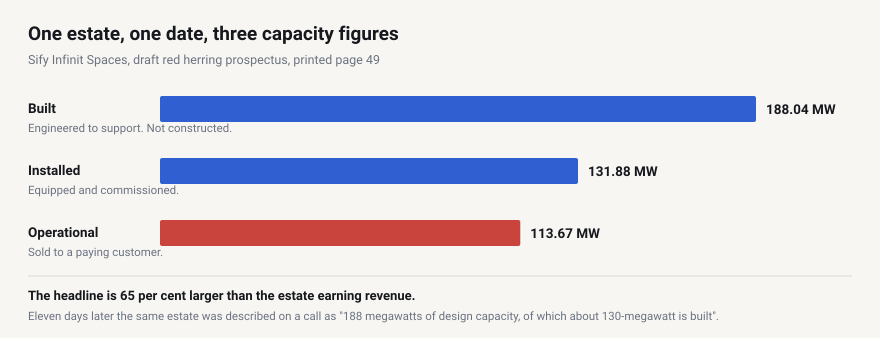
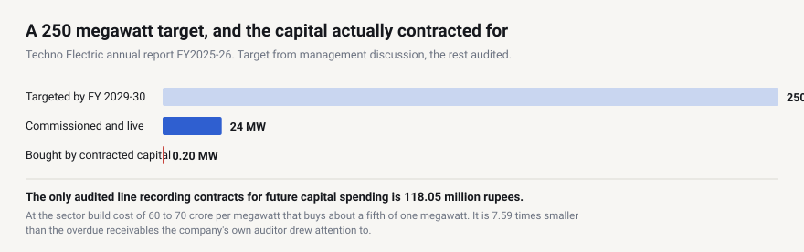
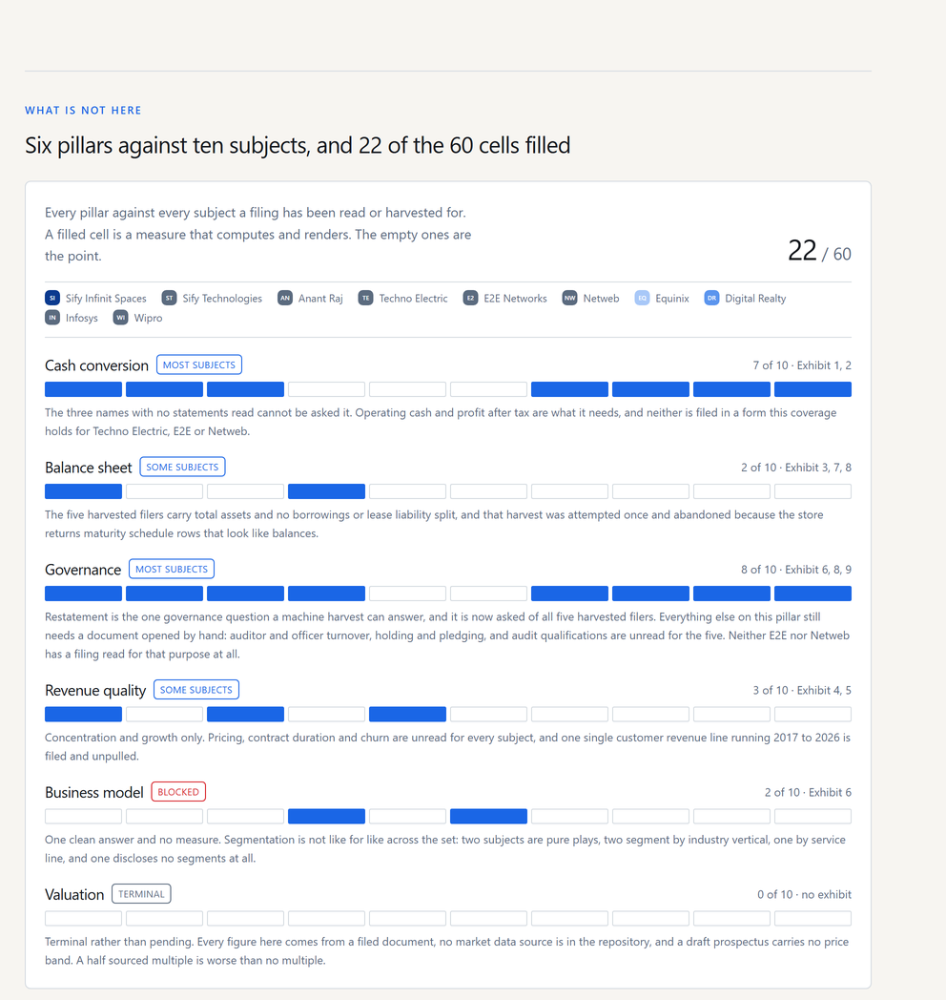
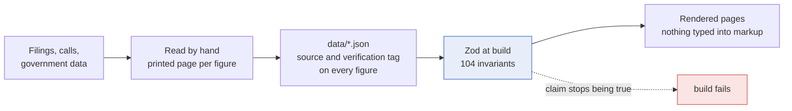

# Ground Truth

**India's data centre buildout, announced against delivered.**

India plans in gigawatts. The filings are written in megawatts, and the words in them do not mean
what a capacity table implies. This reads the primary documents and puts the two side by side.

[**See it live**](https://datacenter-capacity-audit.vercel.app) · 11 routes · 104 build invariants ·
every figure carries the printed page it came from

---

## One estate. One date. Three different numbers.



All three are the company's own, in one filing, on one date. **Built** does not mean constructed. The
prospectus defines it as "the maximum IT load a data center is engineered to support", calculated
from "present design specifications".

Eleven days later, on an earnings call, the same estate was described as "188 megawatts of design
capacity, of which about 130-megawatt is built". **The call used the ordinary meanings. The filed
document moved the words one rung up.**

That is the research question: when a company says X MW, which X is it?

---

## Across every operator, the gap is the story


**Anant Raj** announces 307 MW and calls 28 MW operational. Its own annual report reports **8 MW
handed over** to customers, which is 2.6 per cent of what was announced. The 28 breaks down as 6 MW
operationalised, 15 ready to operationalise and 7 at advance stage: three states of readiness inside
one headline.

**E2E Networks** publishes no capacity at all. Its annual report contains **no megawatt or kilowatt
figure anywhere in 148 pages**. It is a tenant in someone else's hall. That row stays tagged
unverified, because a figure nobody checked and a figure the company does not publish are different
problems.

---

## What reading one filing end to end produces



Techno Electric calls its data centre business "the most consequential strategic decision we have
made in a generation". Reading all **433 printed pages** of the annual report:

| What the accounts say | Figure |
|---|---:|
| Contracts on capital account remaining to be executed | **118.05 mn** |
| Tax demands disputed and unprovided | 251.03 mn |
| Overdue receivables the auditor drew attention to, unprovided | **896.35 mn** |
| Moved from trade payables to borrowings with no cash moving | **194.59 mn** |
| Owed to micro and small enterprises, all of it past its due date | **403.83 mn** |

- **No segment disclosure exists.** No Ind AS 108, no reportable segment, no chief operating decision
  maker, anywhere in the document. So the business it calls its most consequential decision has no
  revenue, margin or asset base a reader can separate from the engineering business funding it.
- **A liability changed line without cash moving.** A supplier finance arrangement lengthened payment
  terms from 60 to 90 days out to 120 to 180, and moved 194.59 mn into borrowings as a non cash
  transfer. 97 per cent of what the standalone reports as current borrowings arrived that way.
- **One note contradicts the next.** The ageing table places the entire 403.83 mn owed to micro and
  small enterprises past its due date. The five statutory clauses printed on the following page
  report nil at every one.

---

## The measures that came out the wrong way

A project that only ever finds companies wanting is editorialising rather than measuring.

**Asked how often each operator refuses a unit economics question, the Indian operator refuses
least.** Sify 2 of 15, Equinix 9 of 20, Digital Realty 9 of 34. And the rate alone still misleads,
because Sify is asked 0.43 such questions a call against Digital Realty's 0.81. **A company nobody
presses has little to refuse**, so the denominator is drawn as the bar rather than tucked into a
footnote.

**The same correction was needed a second time**, on restatement rates, where one filer was harvested
for 18 data points and another for 76.

**The stated pivot is real in the accounts.** Sify's data centre revenue rose from 22.78 to 39.04 per
cent of group revenue across six years.

**A published error is kept on the page.** This site once claimed the prospectus disclosed no revenue
concentration by customer. Wrong: the searches used the word customer and the filing says client. The
correction log is public, because a correction log is worth more than a clean one.

---

## What it does not claim



Coverage is counted, not described. **22 of 60 cells.** The empty ones are drawn rather than omitted,
and each state label is checked against the coverage it claims, so a label that stops describing its
row fails the build.

**Valuation is terminal, not pending.** No market data source is in the repository and a draft
prospectus carries no price band. A half sourced multiple is worse than no multiple.

---

## How a claim is kept honest

Findings become build invariants. **104 of them.** If a published claim stops being true the build
fails, rather than the page quietly going stale.



Four documents read page by page, all SHA256 pinned. 119 earnings calls coded. Five SEC filers
harvested. One Ministry of Power dataset. 139 tests, and every invariant is published on
[the methodology page](https://datacenter-capacity-audit.vercel.app/methodology) with the message it
emits when it fires.

---

## Frequently asked

**What does "built capacity" mean in a data centre filing?**
It can mean designed rather than delivered. One prospectus defines it as the maximum IT load a
facility is engineered to support, from design specifications and total planned electrical load.
Nothing has to be constructed for that number to be true.

**Is announced capacity the same as operational capacity?**
No. Across the operators covered, delivered capacity runs from 60 per cent of the headline down to
zero.

**How much of India's announced data centre capacity is earning revenue?**
Two operators announcing 8,000 MW between them have delivered nothing. The best performer keeps 60
per cent of its widest figure by the time it reaches revenue.

**Where do the figures come from?**
Draft red herring prospectuses, exchange filed annual reports, 10-K and 20-F filings via SEC EDGAR,
earnings call transcripts, and a Ministry of Power dataset tabled in the Rajya Sabha.

**Is this investment advice?**
No. See [docs/DISCLAIMER.md](docs/DISCLAIMER.md).

---

<details>
<summary><strong>How to audit any figure yourself</strong></summary>

Every figure carries a `Source` and a verification tag. **PRIMARY** was read from a filing, a tariff
order or a government dataset. **SECONDARY** is carried in from a named publisher. **UNVERIFIED**
marks work not yet done. A row cannot claim PRIMARY without naming a filed document, and that is
checked rather than trusted.

Figures read from a filing also carry the printed page. The documents are not committed, because
they run to 12 MB, but each manifest records the URL, a SHA256 and the printed to PDF page mapping,
so anyone can re download the file and check a number against it.

Page mappings are stored as the position of printed page one, never as a signed offset, because a
position cannot be read backwards. A build guard recomputes every anchor from the declared mapping,
so a citation and its evidence cannot drift apart.

</details>

<details>
<summary><strong>Running it</strong></summary>

```bash
npm install && npm run dev
npm run check:prose && npm test && npm run build
```

`npm run build` is what validates the data through Zod and runs every invariant. The offline pipeline
needs a [data.gov.in](https://data.gov.in) key; copy `.env.example` to `.env`, then
`python pipeline/ists_base_rate.py`. README charts regenerate with
`node scripts/make-readme-charts.mjs`.

</details>

---

- [ARCHITECTURE.md](ARCHITECTURE.md), how it is built and why
- [docs/SOURCES.md](docs/SOURCES.md), every document actually read, and what came out of it
- [ROADMAP.md](ROADMAP.md), what is deliberately unfinished, and what is terminal rather than pending
- [docs/GOTCHAS.md](docs/GOTCHAS.md), the failures that cost real time once

Code is Apache 2.0, see [LICENSE](LICENSE) and [NOTICE](NOTICE). The figures are facts drawn from
public filings, government datasets and earnings calls. Quoted excerpts remain the property of their
publishers and are used as short attributed quotations for analysis and comment. Not affiliated with
any company or agency named.
