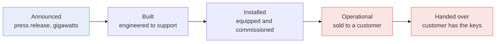
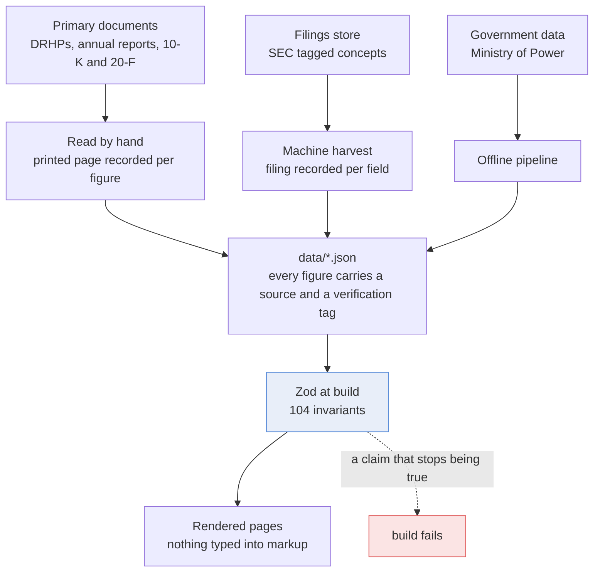
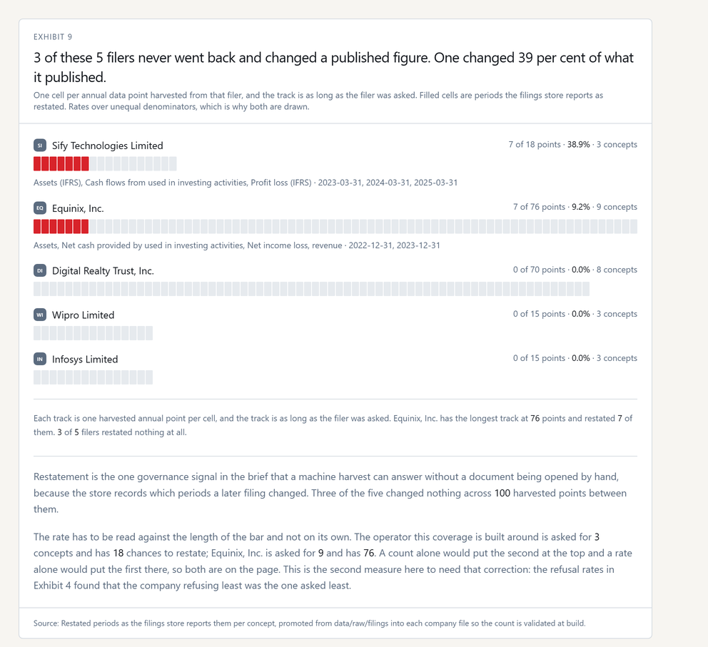

# Ground Truth

**India's data centre buildout, announced against delivered. Reconciling what companies say
with what their filings support.**

India is planning its data centre and AI infrastructure buildout in gigawatts. The filings are
written in megawatts, and the words in them do not mean what a capacity table implies. This reads
the primary documents, keeps announced capacity and delivered capacity in separate columns, and
publishes the printed page behind every figure.

**[See the live product](https://datacenter-capacity-audit.vercel.app)**

---

## The finding, in three rows

One estate. One date. Three different numbers, all of them the company's own.

| Rung | MW | What the prospectus says it means |
|---|---:|---|
| **Built** | **188.04** | "the maximum IT load a data center is engineered to support", from "present design specifications" |
| **Installed** | **131.88** | "equipped, powered and commissioned for operation" |
| **Operational** | **113.67** | "sold to customers during the year or period for which revenue from operations is generated" |

Sify Infinit Spaces, draft red herring prospectus, printed page 49. The headline is **65 per cent
larger** than the estate earning revenue.

Eleven days after that document was dated, the same estate was described on an earnings call as
"188 megawatts of design capacity, of which about 130-megawatt is built". The call used the ordinary
meanings. **The filed document moved the words one rung up.**

That is the whole research question: when a company says X MW, which X is it?



Most capacity tables print one of these five and do not say which.

---

## Is announced capacity the same as operational capacity?

No, and the gap varies by an order of magnitude between operators.


**Anant Raj** announces 307 MW, calls 28 MW operational, and reports **8 MW handed over** to
customers. That is 2.6 per cent of what was announced. Its own annual report breaks the 28 down as
6 MW operationalised, 15 MW ready to operationalise and 7 MW at advance stage, which is three
different states of readiness inside one headline.

**Sify** keeps 60 per cent of its widest figure by the time it reaches revenue. **Anant Raj keeps
2.6.** Both numbers are the companies' own.

---

## What happens when you read the whole filing

Techno Electric targets **250 MW by FY 2029-30** and calls the data centre business "the most
consequential strategic decision we have made in a generation". Its annual report runs to 433
printed pages. Reading them:


- The only audited line recording contracts for future capital spending is **118.05 million rupees**.
  At the sector build cost of 60 to 70 crore per megawatt that buys **0.17 to 0.20 MW**.
- It is **2.13 times smaller** than the tax the company disputes, and **7.59 times smaller** than the
  **896.35 million** of receivables its auditor flagged as substantially overdue and unprovided.
- Across all 433 printed pages the accounts carry **no segment disclosure at all**. No Ind AS 108,
  no reportable segment, no chief operating decision maker. So the business it calls its most
  consequential decision has no revenue, margin or asset base a reader can separate from the
  engineering business funding it.
- A supplier finance arrangement moved **194.59 million** from trade payables into borrowings as a
  **non cash transfer**, so 97 per cent of what the standalone reports as current borrowings arrived
  without cash moving. The company chose the stricter of the two available treatments, and that is
  on the page too.
- The trade payables ageing places **the entire 403.83 million** owed to micro and small enterprises
  past its due date, with nothing in the not due column, in both years. The five MSMED Act clauses
  printed on the very next page report **nil at every one**.

---

## How much of the announced capacity is earning revenue?

| Operator | Announced | Delivered | Delivered share |
|---|---:|---:|---:|
| Adani Enterprises | 5,000 MW | 0 | 0% |
| Reliance Industries | 3,000 MW | 0 | 0% |
| Bharti Airtel, Nxtra | 1,000 MW | 125 MW | 13% |
| STT GDC India | 868 MW | 318 MW | 37% |
| Anant Raj | 307 MW | 28 MW claimed, **8 handed over** | 9%, **2.6% handed over** |
| Techno Electric | 250 MW | 24 MW | 10% |
| Sify Infinit Spaces | 188.04 MW built | 113.67 MW operational | 60% |
| E2E Networks | 25 MW | 10 MW | 40%, and **unverified** |

E2E's row is tagged unverified for a reason worth stating: its annual report contains **no megawatt
or kilowatt figure anywhere in 148 pages**. It is a tenant in someone else's hall. A figure nobody
verified and a figure the company does not publish are different problems, and only the first is
fixed by opening the document.

---

## How is any of this checked?



**Findings become build invariants.** 104 of them. If a published claim stops being true, the build
fails rather than the page going stale. Every one is listed on
[the methodology page](https://datacenter-capacity-audit.vercel.app/methodology) with what it
protects and the message it emits.

139 tests. Four documents read page by page, all checksum pinned. 119 earnings calls coded. Five SEC
filers harvested. One government dataset.

---

## What it deliberately does not claim

This is the part that matters most, and it is why the coverage is counted rather than described.


The brief this was built against specifies six forensic pillars. **22 of 60 possible cells are
filled.** The empty ones are drawn rather than omitted, and the four state labels are checked
against the coverage they claim, so a label that stops describing its row fails the build.

**Valuation is terminal, not pending.** No market data source is in the repository and a draft
prospectus carries no price band. A half sourced multiple is worse than no multiple.

---

## Findings that cut against the thesis, kept for that reason

A project that only ever finds companies wanting is editorialising rather than measuring.

**The disclosure measure inverted.** Asked how often each operator refuses a unit economics
question, the Indian operator refuses least: Sify 2 of 15, Equinix 9 of 20, Digital Realty 9 of 34.
And the rate alone would still mislead, because Sify is asked 0.43 such questions a call against
Digital Realty's 0.81. **A company nobody presses has little to refuse**, so the denominator is
drawn as the bar rather than appended as a footnote.

**The same correction, a second time.** Restatement rates need it too.



**The Sify pivot is real in the accounts.** Data centre revenue rose from 22.78 to 39.04 per cent of
group revenue across six years. The stated strategy shows up in the numbers.

**The company confirmed the method while declining the number.** Asked for realisation per megawatt,
Sify declined and then described the reverse working, which is the calculation performed here.

**A published error is kept on the page.** This site once claimed the prospectus disclosed no
revenue concentration by customer. That was wrong: the searches used the word customer and the
filing says client. The correction log is public, because a correction log is worth more than a
clean one.

---

## Frequently asked

**What does "built capacity" mean in a data centre filing?**
It can mean designed rather than delivered. One prospectus defines it as the maximum IT load a
facility is engineered to support, calculated from design specifications and total planned
electrical load. Nothing has to be constructed for that number to be true.

**Is announced capacity the same as operational capacity?**
No. On the operators covered here, delivered capacity ranges from 60 per cent of the headline down
to under 3 per cent.

**Where do the figures come from?**
Draft red herring prospectuses, annual reports filed with the exchanges, 10-K and 20-F filings via
SEC EDGAR, earnings call transcripts, and one Ministry of Power dataset tabled in the Rajya Sabha.
Every figure carries its source. Figures read from a filing carry the printed page.

**Is this investment advice?**
No. See [docs/DISCLAIMER.md](docs/DISCLAIMER.md).

**How current is it?**
Every document is pinned by SHA256 and dated. The site states what has been read and what has not,
and counts both.

---

## How to check any figure

Every figure carries a `Source` with a verification tag. **PRIMARY** was read from a filing, a
tariff order or a government dataset. **SECONDARY** is carried in from a named publisher.
**UNVERIFIED** marks work not yet done. A row cannot claim PRIMARY without naming a filed document,
and that is checked rather than trusted.

Prospectus figures additionally carry the printed page. The documents themselves are not committed,
because they run to 12 MB, but each manifest records the URL, a SHA256 and the printed to PDF page
mapping, so anyone can re download the file and audit a number against it.

Page mappings are stored as the position of printed page one, never as a signed offset, because a
position cannot be read backwards. A build guard recomputes every anchor from the declared mapping,
so a citation and its evidence cannot drift apart.

---

## Running it

```bash
npm install
npm run dev
```

```bash
npm run check:prose
npm test
npm run build
```

`npm run build` is what validates the data through Zod and runs every invariant.

The offline pipeline needs a [data.gov.in](https://data.gov.in) key. Copy `.env.example` to `.env`
and fill it in:

```bash
python pipeline/ists_base_rate.py
```

---

## More

- [ARCHITECTURE.md](ARCHITECTURE.md), how it is built and why
- [docs/SOURCES.md](docs/SOURCES.md), every document actually read, and what came out of it
- [docs/GOTCHAS.md](docs/GOTCHAS.md), the failures that cost real time once
- [ROADMAP.md](ROADMAP.md), what is deliberately unfinished, and what is terminal rather than pending
- [docs/DISCLAIMER.md](docs/DISCLAIMER.md), scope, and what the verification tags mean

## Licence and data

Code is Apache 2.0, see [LICENSE](LICENSE) and [NOTICE](NOTICE).

The figures are facts drawn from public filings, government datasets and earnings calls. Quoted
excerpts remain the property of their publishers and are used as short attributed quotations for
analysis and comment. Not affiliated with any company or agency named.
